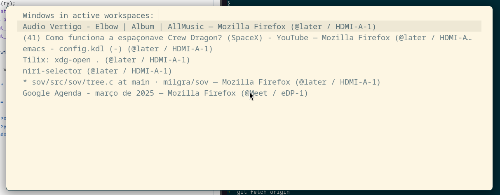

# Niri Window Selector Hack

Quick hack to use [`fuzzel`](https://codeberg.org/dnkl/fuzzel) to select windows and workspaces in [niri](https://github.com/YaLTeR/niri).



It also works when niri's overview is active. While niri [currently does not support filtering in overview](https://github.com/YaLTeR/niri/pull/1440) because [text editing hates you](https://lord.io/text-editing-hates-you-too/), using a `fuzzel` powered window selector improves the experience a bit ;)


## Installation

Run `pip install git+https://github.com/kassick/niri-wselector.git`, or copy the `niri_wselector/__main__.py` script somewhere in your `$PATH`.

Then you can update your niri bindings such as below:

```
    Mod+W hotkey-overlay-title="Windows" { spawn "niri-wselector" "--windows" "-w" "100" ; }
    Mod+Shift+W hotkey-overlay-title="Application Windows" { spawn "niri-wselector" "--windows" "--app-id" "@focused" "-w" "100" ; }
    Mod+Ctrl+W hotkey-overlay-title="Windows in current output" { spawn "niri-wselector" "--windows" "--workspace" "@output" "-w" "100" ; }
    Mod+Alt+W hotkey-overlay-title="Windows on current workspace" { spawn "niri-wselector" "--windows" "--workspace" "@focused" "-w" "100" ; }
    Mod+Alt+Shift+W hotkey-overlay-title="Windows in active workspaces" { spawn "niri-wselector" "--windows" "--workspace" "@active" "-w" "100" ; }
    Mod+S hotkey-overlay-title="Workspaces" { spawn "niri-wselector" "--workspaces" "-w" "100" ; }
```

## Usage

Run the script with either the `--windows` or `--workspaces` option to select _windows_ or _workspaces_.

### Common flags:

-   `--width value` the window width, in characters (`fuzzel`'s `--width`)
-   `--select-focused` selects the focused window or workspace in the window.
    Notice that this causes the placement of the selected window or workspace
    to change -- see below in the _Window_ and _Workspace Ordering_ sections.
-   `--prompt` defines the prompt to be used in fuzzel.

### Window Filtering Options

When running the script with `--windows`, the command line exposes some filtering options you can use:

- `--app-id`: provide an specific app_id (e.g. `org.mozilla.firefox`) to show
  only those application windows. A special value of `@focused` will use the
  `app_id` of the currently focused window -- use it to filter by applications
  of the current application.

-   `--window-matching`: Filters windows whose properties match the ones provided in a json dict.

    For example, you can use `--window-matching '{"app_id": "org.mozilla.firefox"}'`
    to achieve the same as with `--app-id org.mozilla.firefox`. Or you can try fintering
    by floating windows: `--window-matching '{"is_floating": true}'`.

    Any value present in the window object returned by `niri msg --json windows` can be used here.

-   `--workspace`: Only shows windows that appear in workspaces matching the rules.

    The value can be a JSON dictionary to match against the available workspaces -- e.g.
    `--workspace '{"idx": 1}'` will only show windows of workspaces at Index 1.

    This parameters accepts a few special values:
    - `--workspace @focused` will show windows of the currently focused workspace
    - `--workspace @active` shows windows of all active workspaces -- handy if
      you have multiple monitors.
    - `--workspace @output` shows windows of all workspaces of the currently
      focused output.

### Window Ordering

Niri currently does not provide a list of windows in MRU, nor does it provide
the column/row pair in `niri msg windows`, so there is no way of doing
reasonable ordering of windows in a workspace.

Nonetheless, this script tries to ensure a somewhat sane window ordering:

-   **Current workspace**:

    The windows of the current workspace appear first. By default, the focused window is shown **last** among these windows -- you likely do not want to select the window you're currently using ;).

    If you use the `--select-focused` flag, then it will appear **first**,
    because selecting an entry in the middle of the list looks weird.

-   **Active workspaces**:

    All windows in visible workspaces in your other outputs.

-   **Other workspaces of the current output:**

    Windows in other workspaces, ordered by the workspace index.

-   **Workspaces of other outputs**:

    All windows workspaces of your other outputs, ordered by their indexes.

### Workspace Ordering

The workspace priority is similar to the window list priority:

- **Active workspaces**:

    All workspaces visible in your outputs

-   **Workspaces of the current output**:

    These workspaces are ordered by their indexes.

-   **Other outputs workspaces**:

    These are ordered by the output and their indexes

The current workspace appears **last**, by default. If you use the
`--select-focused` option, then its brough up to the first entry.

### Fuzzel Args

You can forward arguments to `fuzzel`:

``` bash
niri-wselector --windows -- --match-mode=exact
```
